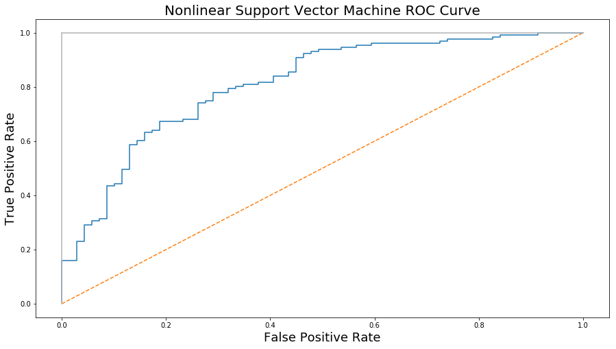

# Final Project


```python
import numpy as np
import pandas as pd
import matplotlib.pyplot as plt
import nltk
from nltk import word_tokenize
from nltk.corpus import stopwords
import string
from sklearn.decomposition import TruncatedSVD
from sklearn.decomposition import PCA
from sklearn.svm import SVC
from sklearn.svm import LinearSVC
from sklearn.tree import DecisionTreeClassifier
from sklearn.ensemble import AdaBoostClassifier
from sklearn.model_selection import train_test_split
from sklearn.metrics import confusion_matrix 
from sklearn.metrics import roc_curve, roc_auc_score
from nltk.stem.lancaster import LancasterStemmer
```


```python
# Loading the whole data set
Original_dataset = pd.read_csv('yelp_review.csv')
```


```python
#Original_dataset.shape
```


```python
data_set = pd.read_csv('data_sample.csv')
```


```python
data_set.sample(n = 5)
comments=list(data_set[data_set.stars==3].text)
print(comments[5])
```

    Meh... I don't see what all the fuss is about. The burgers are good, not spectacular. The frozen custard was nothing to write home about. I had the "shack attack".  I much prefer in'n'out for both their burgers, and those delicious shakes. Better prices as well. But if you're on the strip, and craving a burger, Shake Shack will probably hit the spot.
    


```python
#Original_dataset.groupby('business_id').business_id.count()>1000
```


```python
data_set.groupby('stars').stars.count().plot(kind='bar',legend=False, figsize=(15,8),grid=True, title= 'Count of stars')
```


    <matplotlib.axes._subplots.AxesSubplot at 0x2403f740940>


```python
# Mapping stars column to 0 and 1
df = data_set[['stars','text']]
df['stars'] = df['stars'].map({ 1:0, 2:0, 3:0, 4:1, 5:1})
```

    C:\Users\Babak\AppData\Roaming\Python\Python36\site-packages\ipykernel_launcher.py:3: SettingWithCopyWarning: 
    A value is trying to be set on a copy of a slice from a DataFrame.
    Try using .loc[row_indexer,col_indexer] = value instead
    
    See the caveats in the documentation: http://pandas.pydata.org/pandas-docs/stable/indexing.html#indexing-view-versus-copy
      This is separate from the ipykernel package so we can avoid doing imports until
    


```python
#Sampling 1000 records
sample = df.sample(n=1000)
#print(sample)
```

# Tokenizing and Assigning weight to the terms (TF-IDF Matrix)


```python
# Tokenizing and getting rid of stopping words
def get_tokens(sentence):
#sent = "this is a foo bar, bar black sheep."
    stop = stopwords.words('english') + list(string.punctuation)
    return [i for i in word_tokenize(sentence.lower()) if i not in stop]
```


```python
#token = 'maximum'
#token = LancasterStemmer().stem(token)
#print(token)
```


```python
"""
    Given a text corpus Returns a new Normalized Term Frequency Matrix 
"""
def buildTF(corpus):
    for index,row in corpus.iterrows():
        tokens = get_tokens(corpus.text[index])
        for token in tokens:
            #temp = LancasterStemmer().stem(token)
            corpus.at[index, token] = tokens.count(token)
```


```python
def normalizer(x, maximum):
    return ((0.5+(0.5*x))/maximum)
```


```python
def doubleNormalize(TF):
    for column in TF.columns.values:
        maximum = max(TF[column])
        TF[column]=TF[column].apply(normalizer, args=(maximum,))
```


```python
#TF = buildTF(sample)
X = sample[['text']]
y = sample[['stars']]
buildTF(X)
X = X.drop(['text'], axis = 1)
X = X.fillna(0)
doubleNormalize(X)
X.sample(n=5)
#print(label)
```


<div>
<table border="1" class="dataframe">
  <thead>
    <tr style="text-align: right;">
      <th></th>
      <th>bad</th>
      <th>service</th>
      <th>twice</th>
      <th>row</th>
      <th>...</th>
      <th>really</th>
      <th>could</th>
      <th>n't</th>
      <th>believe</th>
      <th>first</th>
      <th>...</th>
      <th>pre-fabricated</th>
      <th>popcorn</th>
      <th>cardboard</th>
      <th>montford</th>
      <th>t.o.p</th>
      <th>vegetarians</th>
      <th>antipastos</th>
      <th>pastas</th>
      <th>lisa</th>
      <th>slushies</th>
    </tr>
  </thead>
  <tbody>
    <tr>
      <th>649</th>
      <td>0.125</td>
      <td>0.125</td>
      <td>0.25</td>
      <td>0.5</td>
      <td>0.023810</td>
      <td>0.2</td>
      <td>0.125</td>
      <td>0.055556</td>
      <td>0.25</td>
      <td>0.1</td>
      <td>...</td>
      <td>0.5</td>
      <td>0.5</td>
      <td>0.5</td>
      <td>0.5</td>
      <td>0.5</td>
      <td>0.5</td>
      <td>0.5</td>
      <td>0.5</td>
      <td>0.5</td>
      <td>0.5</td>
    </tr>
    <tr>
      <th>359</th>
      <td>0.125</td>
      <td>0.125</td>
      <td>0.25</td>
      <td>0.5</td>
      <td>0.023810</td>
      <td>0.1</td>
      <td>0.125</td>
      <td>0.111111</td>
      <td>0.25</td>
      <td>0.1</td>
      <td>...</td>
      <td>0.5</td>
      <td>0.5</td>
      <td>0.5</td>
      <td>0.5</td>
      <td>0.5</td>
      <td>0.5</td>
      <td>0.5</td>
      <td>0.5</td>
      <td>0.5</td>
      <td>0.5</td>
    </tr>
    <tr>
      <th>712</th>
      <td>0.125</td>
      <td>0.250</td>
      <td>0.25</td>
      <td>0.5</td>
      <td>0.023810</td>
      <td>0.1</td>
      <td>0.125</td>
      <td>0.055556</td>
      <td>0.25</td>
      <td>0.1</td>
      <td>...</td>
      <td>0.5</td>
      <td>0.5</td>
      <td>0.5</td>
      <td>0.5</td>
      <td>0.5</td>
      <td>0.5</td>
      <td>0.5</td>
      <td>0.5</td>
      <td>0.5</td>
      <td>0.5</td>
    </tr>
    <tr>
      <th>87</th>
      <td>0.125</td>
      <td>0.125</td>
      <td>0.25</td>
      <td>0.5</td>
      <td>0.023810</td>
      <td>0.1</td>
      <td>0.125</td>
      <td>0.111111</td>
      <td>0.25</td>
      <td>0.1</td>
      <td>...</td>
      <td>0.5</td>
      <td>0.5</td>
      <td>0.5</td>
      <td>0.5</td>
      <td>0.5</td>
      <td>0.5</td>
      <td>0.5</td>
      <td>0.5</td>
      <td>0.5</td>
      <td>0.5</td>
    </tr>
    <tr>
      <th>750</th>
      <td>0.125</td>
      <td>0.125</td>
      <td>0.25</td>
      <td>0.5</td>
      <td>0.047619</td>
      <td>0.1</td>
      <td>0.125</td>
      <td>0.055556</td>
      <td>0.25</td>
      <td>0.1</td>
      <td>...</td>
      <td>0.5</td>
      <td>0.5</td>
      <td>0.5</td>
      <td>0.5</td>
      <td>0.5</td>
      <td>0.5</td>
      <td>0.5</td>
      <td>0.5</td>
      <td>0.5</td>
      <td>0.5</td>
    </tr>
  </tbody>
</table>
<p>5 rows × 9673 columns</p>
</div>


## 9673 columns without stemming with 1000 records


```python
""" Given a TF Matrix changes it to Inverse Document Frequency (IDF) Matrix """
def multiply(x,y):
    return x*y
def build_TF_IDF(TF):
    for column in TF:
        IDF = np.log10(len(TF[column])/len(TF[TF[column]>0.5]))
        TF[column]=TF[column].apply(multiply, args=(IDF,))
```


```python
build_TF_IDF(X)
```


```python
X.sample(n=5)
```


<div>
<table border="1" class="dataframe">
  <thead>
    <tr style="text-align: right;">
      <th></th>
      <th>bad</th>
      <th>service</th>
      <th>twice</th>
      <th>row</th>
      <th>...</th>
      <th>really</th>
      <th>could</th>
      <th>n't</th>
      <th>believe</th>
      <th>first</th>
      <th>...</th>
      <th>pre-fabricated</th>
      <th>popcorn</th>
      <th>cardboard</th>
      <th>montford</th>
      <th>t.o.p</th>
      <th>vegetarians</th>
      <th>antipastos</th>
      <th>pastas</th>
      <th>lisa</th>
      <th>slushies</th>
    </tr>
  </thead>
  <tbody>
    <tr>
      <th>263</th>
      <td>0.375</td>
      <td>0.31536</td>
      <td>0.674743</td>
      <td>1.261439</td>
      <td>0.071429</td>
      <td>0.3</td>
      <td>0.337371</td>
      <td>0.166667</td>
      <td>0.75</td>
      <td>0.3</td>
      <td>...</td>
      <td>1.5</td>
      <td>1.5</td>
      <td>1.5</td>
      <td>1.5</td>
      <td>1.5</td>
      <td>1.5</td>
      <td>1.5</td>
      <td>1.5</td>
      <td>1.5</td>
      <td>1.5</td>
    </tr>
    <tr>
      <th>549</th>
      <td>0.375</td>
      <td>0.31536</td>
      <td>0.674743</td>
      <td>1.261439</td>
      <td>0.071429</td>
      <td>0.3</td>
      <td>0.674743</td>
      <td>0.166667</td>
      <td>0.75</td>
      <td>0.3</td>
      <td>...</td>
      <td>1.5</td>
      <td>1.5</td>
      <td>1.5</td>
      <td>1.5</td>
      <td>1.5</td>
      <td>1.5</td>
      <td>1.5</td>
      <td>1.5</td>
      <td>1.5</td>
      <td>3.0</td>
    </tr>
    <tr>
      <th>550</th>
      <td>0.375</td>
      <td>0.94608</td>
      <td>0.674743</td>
      <td>1.261439</td>
      <td>0.071429</td>
      <td>0.6</td>
      <td>0.337371</td>
      <td>0.500000</td>
      <td>0.75</td>
      <td>0.3</td>
      <td>...</td>
      <td>1.5</td>
      <td>1.5</td>
      <td>1.5</td>
      <td>1.5</td>
      <td>1.5</td>
      <td>1.5</td>
      <td>1.5</td>
      <td>1.5</td>
      <td>1.5</td>
      <td>1.5</td>
    </tr>
    <tr>
      <th>538</th>
      <td>0.375</td>
      <td>0.31536</td>
      <td>0.674743</td>
      <td>1.261439</td>
      <td>0.071429</td>
      <td>0.3</td>
      <td>0.337371</td>
      <td>0.166667</td>
      <td>0.75</td>
      <td>0.3</td>
      <td>...</td>
      <td>1.5</td>
      <td>1.5</td>
      <td>1.5</td>
      <td>1.5</td>
      <td>1.5</td>
      <td>1.5</td>
      <td>1.5</td>
      <td>1.5</td>
      <td>1.5</td>
      <td>1.5</td>
    </tr>
    <tr>
      <th>798</th>
      <td>0.375</td>
      <td>0.31536</td>
      <td>0.674743</td>
      <td>1.261439</td>
      <td>0.071429</td>
      <td>0.6</td>
      <td>0.337371</td>
      <td>0.666667</td>
      <td>0.75</td>
      <td>0.3</td>
      <td>...</td>
      <td>1.5</td>
      <td>1.5</td>
      <td>1.5</td>
      <td>1.5</td>
      <td>1.5</td>
      <td>1.5</td>
      <td>1.5</td>
      <td>1.5</td>
      <td>1.5</td>
      <td>1.5</td>
    </tr>
  </tbody>
</table>
<p>5 rows × 9673 columns</p>
</div>


# Dimentiality reduction by running SVD


```python
#pca = PCA(n_components=100)
svd = TruncatedSVD(n_components=100)
svd.fit(X)
TF_svd = pd.DataFrame(svd.transform(X))
print("original shape:  ", X.shape)
print("transformed shape: ", TF_svd.shape)
```

    original shape:   (1000, 9673)
    transformed shape:  (1000, 100)
    


```python
print(TF_svd)
```

                 0         1         2         3         4         5         6   \
    0    127.628197  0.215779 -0.139505  0.101325  0.012455 -0.066046 -0.012170   
    1    127.739621  0.268238 -0.222663  0.051913 -0.025000 -0.028291 -0.115145   
    2    127.964230 -0.331426  0.152051  0.089642 -0.001444 -0.076655 -0.054934   
    3    127.685317  0.310417 -0.226151 -0.044535 -0.028985  0.009193  0.031617   
    4    127.762890  0.314334 -0.252994 -0.022487 -0.029012 -0.052633 -0.039847   
    5    128.520796 -0.293444 -0.029450  0.195088 -0.108596  0.049763 -0.389166   
    6    127.803650 -0.016997 -0.020933 -0.087837 -0.017669  0.088629  0.011946   
    7    128.094574  0.177566 -0.227392  0.142509  0.008815 -0.341546  0.038184   
    8    127.778314  0.037096 -0.044365 -0.032274  0.008353 -0.046149  0.062212   
    9    127.651813  0.435712 -0.309273  0.059643 -0.014435 -0.093920 -0.045993   
    10   127.930086  0.187993 -0.214683  0.049125 -0.026150 -0.154264 -0.119425   
    11   127.940489  0.211777 -0.208493  0.037571 -0.007185 -0.162249 -0.030178   
    12   128.283510 -0.857593  0.468182 -0.804548 -0.059335  0.648474  0.182366   
    13   127.700624  0.417018 -0.306013  0.115105 -0.013652 -0.118716 -0.064986   
    14   127.888945 -0.285001  0.133940 -0.175203 -0.021301  0.043322 -0.218935   
    15   128.067105 -0.922112  0.675844 -0.131063  0.026081 -0.014527  0.407568   
    16   127.863785 -0.002293 -0.051453 -0.155079 -0.039774  0.153884 -0.016463   
    17   127.750182  0.170585 -0.135299  0.166978  0.019567 -0.133477 -0.030068   
    18   127.754401  0.234601 -0.187969  0.061966 -0.007614 -0.012103 -0.002304   
    19   127.633520  0.442233 -0.312914 -0.008410 -0.039954 -0.011384  0.024788   
    20   127.689879  0.279611 -0.209025  0.010821 -0.007726 -0.103411 -0.017319   
    21   127.940710 -0.234016  0.069916  0.026984  0.007656 -0.136617 -0.115932   
    22   127.917170 -0.165036  0.050099  0.398730  0.055439 -0.377061 -0.020361   
    23   128.293776 -1.827245  1.183245 -0.833023  0.007537  0.666980  0.411401   
    24   128.173917 -0.126258 -0.039825  0.023702 -0.037928 -0.046896 -0.200080   
    25   127.996481 -0.307876  0.131909 -0.571696 -0.094943  0.376450  0.132672   
    26   127.903351 -0.433054  0.263404 -0.096655 -0.030337  0.219642  0.074044   
    27   127.970442 -0.022851 -0.069727  0.110092 -0.038273  0.002839 -0.094768   
    28   127.917810 -0.102764  0.010430 -0.133277 -0.057355  0.216330 -0.016307   
    29   128.098547  0.067348 -0.103774 -0.171316 -0.081927  0.306690  0.034788   
    ..          ...       ...       ...       ...       ...       ...       ...   
    970  127.783670 -0.048276  0.014467 -0.117605 -0.047303  0.061867 -0.005992   
    971  127.798833 -0.262746  0.142685  0.011229  0.037130 -0.012942  0.133399   
    972  128.217341 -0.371592  0.091818  0.005655 -0.048725 -0.152251 -0.187822   
    973  127.845116  0.034874 -0.053042 -0.034653 -0.066927  0.070769 -0.047648   
    974  127.634672  0.417696 -0.292208  0.004740 -0.030542  0.005324 -0.038082   
    975  127.705652  0.077631 -0.071806 -0.018995 -0.002608 -0.023422  0.004438   
    976  127.870582 -0.245800  0.183003 -0.143174 -0.040008  0.026415  0.043275   
    977  127.959767 -0.028135 -0.063649 -0.006153 -0.010039 -0.031136 -0.023580   
    978  127.634477  0.400512 -0.275083  0.061865 -0.015236 -0.038033 -0.027108   
    979  128.366695 -1.343874  0.804813  0.126315  0.016952  0.471454  0.222609   
    980  127.760024  0.130089 -0.123618  0.002356 -0.013719 -0.106269 -0.015753   
    981  128.291004 -0.748869  0.385234  0.723037  0.187326 -0.821478  0.062843   
    982  127.985663 -0.231367  0.073309 -0.117228 -0.034058  0.186833  0.113401   
    983  128.032566 -0.344871  0.199924 -0.471026 -0.084082  0.353126  0.027896   
    984  128.200053 -0.667269  0.316604  0.035402 -0.030908  0.347547 -0.062155   
    985  127.914459 -0.158167  0.061229 -0.169747 -0.078930  0.225681  0.010447   
    986  128.375335 -1.303669  0.727679 -1.103082 -0.175808  0.961566  0.045880   
    987  127.636236  0.425394 -0.296127 -0.012452 -0.031943 -0.011418 -0.004625   
    988  127.762113  0.266932 -0.212019  0.004627 -0.023018 -0.064769 -0.075237   
    989  127.821524  0.097644 -0.106195  0.028268  0.009295 -0.151647  0.038731   
    990  128.199535 -1.425567  1.022443 -0.565383 -0.155212  0.601452  0.116951   
    991  127.952327 -0.453341  0.242669  0.054320  0.035371 -0.177679 -0.085268   
    992  127.705379  0.338212 -0.249766  0.031582 -0.019500 -0.048954 -0.043782   
    993  127.945808 -0.480286  0.286166 -0.067767  0.044585  0.099985  0.166334   
    994  128.049187 -0.204361  0.046849  0.222951  0.035629 -0.277504 -0.049659   
    995  128.177219 -0.810674  0.436899 -0.214546 -0.000454  0.216687 -0.033892   
    996  127.616724  0.334879 -0.229405 -0.078814 -0.031832  0.090014 -0.004084   
    997  127.766012  0.044285 -0.053394 -0.158823 -0.003767  0.127164 -0.030932   
    998  127.614495  0.394760 -0.265021  0.001356 -0.014701 -0.014526 -0.012658   
    999  127.652383  0.355642 -0.248972  0.049505 -0.014191 -0.060472 -0.027193   
    
               7         8         9     ...           90        91        92  \
    0    0.010102  0.029073  0.010376    ...    -0.007124 -0.051352  0.016431   
    1   -0.002992  0.080764  0.119489    ...     0.027771  0.063785  0.074953   
    2    0.083807 -0.107015  0.102299    ...     0.057527  0.035162  0.266864   
    3   -0.110363 -0.083830  0.011340    ...    -0.066774 -0.107351 -0.010942   
    4    0.065885 -0.101814 -0.063631    ...     0.066994 -0.129336  0.023543   
    5    0.362020 -0.161471 -0.298960    ...     0.094498 -0.079333  0.028066   
    6   -0.089820  0.021910  0.051484    ...     0.081549  0.099601  0.129109   
    7   -0.223200  0.002391 -0.063911    ...    -0.183574  0.325822  0.618849   
    8   -0.140757  0.056364 -0.115170    ...    -0.033746 -0.029489  0.106936   
    9    0.005412 -0.079802  0.065161    ...    -0.010732  0.045883 -0.064530   
    10  -0.093688  0.099358  0.001745    ...    -0.183231 -0.255627  0.209797   
    11  -0.117823  0.117453 -0.131334    ...    -0.128882  0.040550 -0.223570   
    12   0.084138 -0.188123 -0.011015    ...     1.192496  0.851219  0.178355   
    13  -0.033372  0.048466  0.037423    ...     0.094864 -0.073675  0.013751   
    14   0.434644 -0.098814 -0.161366    ...     0.141288  0.348357  0.011420   
    15   0.008875  0.030166  0.020980    ...    -1.471313  0.085858 -0.158214   
    16  -0.026218 -0.063853 -0.002584    ...     0.252714  0.263938  0.010477   
    17   0.116756 -0.080481 -0.060791    ...     0.142945 -0.074037 -0.032490   
    18  -0.017303 -0.062194  0.016758    ...     0.034190 -0.052642  0.057405   
    19   0.033012 -0.018942  0.023989    ...     0.042264  0.001051  0.006252   
    20  -0.035230 -0.057557 -0.058302    ...     0.115615  0.019413 -0.029210   
    21   0.036917 -0.056732  0.056535    ...     0.188457  0.050323 -0.056669   
    22  -0.026587 -0.103316  0.097908    ...     0.266264  0.280597  0.124504   
    23  -0.206816 -0.129754  0.199058    ...    -1.031573 -0.581617 -0.403505   
    24   0.022959 -0.037847  0.041656    ...    -0.386757 -0.808878  0.091587   
    25  -0.171194 -0.028486  0.010480    ...     0.713932 -0.122480  0.312577   
    26  -0.074138  0.130642  0.016374    ...     0.196179  0.215300  0.042775   
    27   0.174026 -0.105860 -0.016218    ...     0.301987 -0.070073 -0.005328   
    28  -0.158554  0.090200 -0.094699    ...    -0.082013  0.256546 -0.229279   
    29  -0.229686 -0.101428  0.000675    ...     0.239474  0.186918 -0.208247   
    ..        ...       ...       ...    ...          ...       ...       ...   
    970 -0.026655 -0.020908  0.080565    ...    -0.044860  0.066985 -0.130007   
    971 -0.034458 -0.110942 -0.023938    ...     0.154472 -0.083985 -0.013372   
    972  0.180708  0.250268  0.003577    ...     0.567755 -0.449658 -1.898641   
    973 -0.082225  0.075706  0.035205    ...    -0.084230  0.046215 -0.058946   
    974  0.016612 -0.009851 -0.030292    ...     0.026180 -0.070474 -0.042039   
    975 -0.041715 -0.060545 -0.012906    ...     0.014422  0.026285 -0.169412   
    976 -0.053183 -0.052291 -0.025900    ...     0.240764  0.197638  0.075077   
    977 -0.156961  0.026986 -0.041623    ...     0.150676  0.035520  0.102731   
    978 -0.020767  0.004300 -0.033776    ...    -0.146519 -0.034788  0.063365   
    979 -0.168397 -0.347632  0.333115    ...    -0.233595 -0.566144 -0.739890   
    980 -0.027876 -0.108361 -0.018973    ...     0.058021 -0.088246  0.021558   
    981 -0.258357  0.188448 -0.047176    ...    -0.379209  1.163944 -0.177842   
    982 -0.204653 -0.158986  0.055814    ...     0.318542 -0.322867  0.256100   
    983 -0.257426  0.209901 -0.101314    ...     0.502104 -0.154989 -0.533878   
    984  0.085231  0.239255  0.069808    ...    -1.297555  0.806908  0.123073   
    985 -0.020105  0.100216 -0.062978    ...    -0.609394  0.151565 -0.349331   
    986 -0.191195  0.246229  0.277452    ...     0.113563 -0.342541 -0.462510   
    987 -0.039982 -0.079100 -0.004568    ...     0.020956  0.029421  0.028398   
    988  0.039625 -0.104128 -0.100402    ...     0.065468 -0.044874  0.073392   
    989 -0.068429 -0.107961 -0.024567    ...    -0.160557  0.066573 -0.073236   
    990 -0.231133  0.078171  0.114559    ...     0.477388  0.432273 -0.304570   
    991  0.110777  0.030844  0.044103    ...    -0.303785  0.350424 -0.041163   
    992 -0.025005 -0.010379  0.031445    ...     0.063335 -0.055592 -0.084905   
    993 -0.083606 -0.013736  0.032893    ...    -0.001045  0.085781 -0.377659   
    994 -0.083282  0.125805 -0.042447    ...    -0.230496  0.023910  0.406145   
    995 -0.135502  0.236068  0.133664    ...     0.263114 -1.136537 -0.955450   
    996 -0.005315 -0.027619 -0.004974    ...     0.055314 -0.046124 -0.002644   
    997  0.039993 -0.015511 -0.116850    ...    -0.121031  0.075744 -0.065288   
    998 -0.020689 -0.034678 -0.015864    ...     0.011280  0.012598 -0.009884   
    999 -0.057212  0.025570 -0.070223    ...     0.047275 -0.097997  0.045188   
    
               93        94        95        96        97        98        99  
    0   -0.062315 -0.002363 -0.086696 -0.088568  0.015269  0.050554  0.027836  
    1    0.057819 -0.046514 -0.133499  0.096620 -0.210452 -0.049640 -0.083052  
    2   -0.018875 -0.338629 -0.135226  0.122327  0.194391 -0.091647 -0.716155  
    3   -0.106550  0.013026 -0.019524  0.106672  0.099261 -0.015722  0.070587  
    4   -0.071944 -0.062572 -0.152577 -0.078851 -0.117697  0.012046  0.069762  
    5   -0.429737  0.192876 -0.267228  0.224597 -0.297455 -0.396789 -0.154483  
    6    0.235850 -0.150591 -0.141115 -0.111199  0.009829 -0.218184 -0.250174  
    7    0.139365  0.224514  0.519828 -0.518900 -0.330346  0.143622  0.115692  
    8    0.074516  0.022778 -0.121560 -0.128866  0.077473  0.106476 -0.021679  
    9    0.016720  0.047767  0.056155  0.034288 -0.034478 -0.031866  0.057560  
    10   0.031382 -0.134084  0.149081  0.177614 -0.363019 -0.047999 -0.191543  
    11   0.134865  0.207573  0.010600 -0.055410 -0.138487 -0.047793 -0.018688  
    12   0.321948 -0.712883  1.235028 -0.119371 -0.327097 -0.209791  0.647898  
    13  -0.106215  0.089813  0.031826  0.062349 -0.009576 -0.020182  0.008952  
    14  -0.126787  0.346980  0.149075  0.244755  0.152274 -0.412924  0.514952  
    15  -0.738293 -0.617045 -0.628916  0.608834 -0.212607  0.707103 -0.306836  
    16  -0.162717  0.257951  0.184813 -0.018939 -0.231484  0.104156 -0.046697  
    17  -0.075904  0.074571 -0.128311  0.091067 -0.090039  0.050531  0.105588  
    18   0.047198 -0.050447  0.199391 -0.035519  0.110890  0.195490  0.012236  
    19   0.019043 -0.011601 -0.063277 -0.061769 -0.045746  0.051738  0.031984  
    20   0.062555 -0.130202  0.131748 -0.000456 -0.044901  0.038681  0.014699  
    21  -0.400547 -0.014661  0.495582  0.202422  0.362170  0.093956  0.366235  
    22  -0.002893 -0.118261  0.116658  0.070095  0.383084 -0.372198 -0.315589  
    23  -0.469973 -0.632196  0.746065 -0.513205 -0.528346  0.846857  0.279790  
    24   0.625290 -0.059499  0.850606  0.577313 -0.822059  1.860812 -0.650112  
    25  -0.198804 -0.334019 -0.341024  0.623858  0.463014 -0.521353 -0.209936  
    26   0.044741 -0.161018 -0.081914 -0.411797  0.408973 -0.184121 -0.502489  
    27  -0.118745  0.241820  0.056037  0.240312 -0.057354 -0.277390  0.118634  
    28  -0.058953  0.100617 -0.093507  0.093489 -0.186743 -0.277142 -0.050088  
    29   0.426375  1.044479 -0.064247  0.169914  0.057037  0.751864  0.437827  
    ..        ...       ...       ...       ...       ...       ...       ...  
    970  0.200315 -0.007191  0.077408  0.370996  0.059360  0.060084  0.046799  
    971  0.109194 -0.129333 -0.121547  0.162259  0.221763  0.061625 -0.046996  
    972 -0.130866  0.081726 -0.702302 -1.659779  1.228978  1.043746 -0.517419  
    973  0.072706  0.022658 -0.054408  0.251489  0.009044 -0.273211  0.131933  
    974 -0.036449  0.039980 -0.025783  0.007145  0.052364 -0.010259  0.026050  
    975 -0.119304 -0.220617 -0.108692  0.002157 -0.061126  0.086904 -0.010306  
    976 -0.344328  0.000752 -0.124064 -0.205707  0.400945  0.288910 -0.454006  
    977 -0.234738 -0.208483 -0.367681 -0.444516 -0.357135  0.462984  0.333478  
    978 -0.049180  0.070342 -0.011867  0.004433  0.040804 -0.006724  0.037991  
    979 -0.894755 -0.250347  0.276263  0.269602 -1.075962 -0.086502 -0.072602  
    980  0.051562 -0.051721  0.018356  0.078094  0.090071  0.148583 -0.085262  
    981  0.067906  0.342508  0.147711  0.809340  0.581900  0.307137 -0.172369  
    982 -0.136134 -0.369360 -0.249541 -0.410187  0.075667  0.128412  0.431923  
    983 -0.627235 -0.062875 -0.550469  0.133223  0.785673 -0.055214  0.165401  
    984 -1.127982  1.155779  0.489430 -0.365051 -0.377387  0.300094 -0.624313  
    985  0.124975 -0.009887  0.064251  0.067597 -0.089988  0.127311  0.074695  
    986  0.425756  0.096025  0.036805  0.128236 -0.485899  0.050849 -0.171279  
    987 -0.036781  0.029187  0.001670  0.085393  0.039884 -0.048885  0.005804  
    988  0.008013  0.072421  0.035957 -0.272662 -0.123152  0.008254 -0.010187  
    989  0.083863 -0.120712 -0.033073  0.211663 -0.000329  0.140336  0.091966  
    990  0.375185 -0.839956 -0.329345  0.215875  0.048203  0.799737  0.759786  
    991 -0.041656 -0.364291  0.204572 -0.473491  0.256784  0.578335 -0.115246  
    992  0.030408  0.039017  0.225388  0.124614  0.066503  0.031962 -0.077554  
    993  0.109629 -0.301783 -0.305430  0.354497  0.195637  0.009130  0.137328  
    994  0.290751 -0.953909 -0.225067  0.009058 -0.040480  0.974309 -0.817483  
    995 -0.893047 -0.648742 -0.000129  0.383451  0.594594 -1.124881 -0.416399  
    996 -0.024596  0.077793 -0.025697 -0.010777 -0.043193 -0.011387  0.008519  
    997 -0.018348 -0.060835  0.153914  0.068480  0.073539 -0.042854 -0.003335  
    998  0.062951  0.054468  0.019783 -0.014340  0.001448 -0.031101  0.004240  
    999 -0.056192 -0.010185 -0.063567  0.019284 -0.013400  0.063290  0.023873  
    
    [1000 rows x 100 columns]
    

# Splitting Data into Training and Test set


```python
# Splitting data into train data and test data
X_train, X_test, y_train, y_test = train_test_split(TF_svd, y, test_size=.2, random_state=0)
```

# Model Development
## Kernel SVM Model


```python
# Create a SVC classifier using an RBF kernel
svm = SVC(kernel='rbf', random_state=0, gamma=0.02, C=110, probability=True)
# Train the classifier
model = svm.fit(X_train, y_train.values.ravel())
# Get the predictions
y_predicted = model.predict(X_test)
y_score_SVMk = model.predict_proba(X_test)[:,1]
```


```python
get_metrics(y_predicted, y_test)
```

    Recall 0.823529411765
    Precision 0.854961832061
    Error_rate 0.215
    Accuracy 0.785
    F1 Score 0.838951310861
    


```python
# Create true and false positive rates
false_positive_rate, true_positive_rate, threshold = roc_curve(y_test, y_score_SVMk)

# Plot ROC curve
plt.figure(figsize=(15,8))
plt.title('Nonlinear Support Vector Machine ROC Curve', fontsize=20)
plt.plot(false_positive_rate, true_positive_rate)
plt.plot([0, 1], ls="--")
plt.plot([0, 0], [1, 0] , c=".7"), plt.plot([1, 1] , c=".7")
plt.ylabel('True Positive Rate', fontsize=18)
plt.xlabel('False Positive Rate', fontsize=18)
plt.show()
print('Area Under the Curve',roc_auc_score(y_test, y_score_SVMk))
```





    Area Under the Curve 0.810377254121
    

## Training different SVM models with various Gamma values


```python
# Training different svm kernel models with different gamma values
gamma = np.arange(0.005, 0.99, 0.05)
error_rate =[]
for g in gamma:
    # Create a SVC classifier using an RBF kernel
    svmk = SVC(kernel='rbf', random_state=0, gamma=g, C=80)
    # Train the classifier
    model = svmk.fit(X_train, y_train.values.ravel())
    # Get the predictions
    temp = model.predict(X_test)
    tn, fp, fn, tp = confusion_matrix(temp,y_test).ravel()
    error_rate.append((fn+fp)/(tp+fn+fp+tn))
```


```python
plt.subplots(figsize=(15,8))
plt.plot(gamma,error_rate)
plt.grid(zorder=0)
plt.ylabel('Error-rate', fontsize=20)
plt.xlabel('Gamma values', fontsize=20)
plt.title('Error Rate with different Gamma Values', fontsize = 20)
```


    Text(0.5,1,'Error Rate with different Gamma Values')


## Training different SVM models with various Cost values


```python
# Training different svm kernel models with different C values
C = np.arange(100, 300, 5)
error_rate =[]
for c in C:
    # Create a SVC classifier using an RBF kernel
    svmk = SVC(kernel='rbf', random_state=0, gamma=0.1, C=c)
    # Train the classifier
    model = svmk.fit(X_train, y_train.values.ravel())
    # Get the predictions
    temp = model.predict(X_test)
    tn, fp, fn, tp = confusion_matrix(temp,y_test).ravel()
    error_rate.append((fn+fp)/(tp+fn+fp+tn))
```


```python
plt.subplots(figsize=(15,8))
plt.plot(C,error_rate,color = 'red')
plt.grid(zorder=0)
plt.ylabel('Error-rate', fontsize=20)
plt.xlabel('Cost', fontsize=20)
plt.title('Error Rate using different C Values', fontsize = 20)
```


    Text(0.5,1,'Error Rate using different C Values')


```python
#tp = conf[0][0]
#fn = conf[1][0]
#fp = conf[0][1]
#tn = conf[1][1]
def get_metrics(y_predicted,y_test):
    tn, fp, fn, tp = confusion_matrix(y_predicted,y_test).ravel()
    recal = tp/(tp+fn)
    precision = tp/(tp+fp)
    error_rate = (fn+fp)/(tp+fn+fp+tn)
    F1 = 2*((precision*recal)/(precision+recal))
    print('Recall', recal)
    print('Precision', precision)
    print('Error_rate', error_rate)
    print('Accuracy', 1-error_rate)
    print('F1 Score', F1)
```

## Linear SVM model


```python
# Create a linear SVM classifier 
C = np.arange(0.1, 0.99, 0.1)
error_rate =[]
for c in C:
    linearSVM = LinearSVC(random_state=0, C = c)
    # Train the classifier
    model = linearSVM.fit(X_train, y_train.values.ravel())
    # Get the predictions
    temp = model.predict(X_test)
    tn, fp, fn, tp = confusion_matrix(temp,y_test).ravel()
    error_rate.append((fn+fp)/(tp+fn+fp+tn))
```


```python
plt.subplots(figsize=(15,8))
plt.plot(C,error_rate,color = 'red')
plt.grid(zorder=0)
plt.ylabel('Error-rate', fontsize=20)
plt.xlabel('Cost', fontsize=20)
plt.title('Linear SVM Error Rate using different penalizing parameter', fontsize = 20)
```


    Text(0.5,1,'Linear SVM Error Rate using different penalizing parameter')


```python
linearSVM = LinearSVC(random_state=0, C = 0.3)
# Train the classifier
model = linearSVM.fit(X_train, y_train.values.ravel())
# Get the predictions
y_predicted = model.predict(X_test)
```


```python
get_metrics(y_predicted, y_test)
```

    Recall 1.0
    Precision 0.0916030534351
    Error_rate 0.595
    Accuracy 0.405
    F1 Score 0.167832167832
    

## Bagged kernel approach


```python
bagNum = 50
y_bagged = []
for i in range(bagNum):
    SX_train, SX_test, Sy_train, Sy_test = train_test_split(TF_svd, y, test_size=.1, train_size=.4, random_state= 42)
    # Create a SVC classifier using an RBF kernel
    DT_classifier = DecisionTreeClassifier(criterion='gini', min_samples_leaf=10, random_state=0, max_depth=5)
    # Train the classifier
    model = DT_classifier.fit(SX_train, Sy_train.values.ravel())
    # Get the predictions
    yi = model.predict(X_test)
    y_bagged.append(yi)
```


```python
new_y = pd.DataFrame(y_bagged).transpose()
```


```python
#print(new_y)
```


```python
#(new_y == 0).astype(int).sum(axis=1)
```

## Decision Tree Model


```python
classifier = DecisionTreeClassifier(criterion='gini', min_samples_leaf=10, random_state=0, max_depth=5)
DT_model = classifier.fit(X_train, y_train)#.predict_proba(X_test)
y_DT = DT_model.predict(X_test)
y_score_DT = DT_model.predict_proba(X_test)[:,1]
```


```python
get_metrics(y_DT, y_test)
```

    Recall 0.760273972603
    Precision 0.847328244275
    Error_rate 0.275
    Accuracy 0.725
    F1 Score 0.801444043321
    


```python
# Create true and false positive rates
false_positive_rate, true_positive_rate, threshold = roc_curve(y_test, y_score_DT)

# Plot ROC curve
plt.figure(figsize=(15,8))
plt.title('Decision Tree ROC Curve', fontsize=20)
plt.plot(false_positive_rate, true_positive_rate)
plt.plot([0, 1], ls="--")
plt.plot([0, 0], [1, 0] , c=".7"), plt.plot([1, 1] , c=".7")
plt.ylabel('True Positive Rate', fontsize=18)
plt.xlabel('False Positive Rate', fontsize=18)
plt.show()
print('Area Under the Curve',roc_auc_score(y_test, y_score_DT))
```


    Area Under the Curve 0.730722425047
    

# Adaboost Model


```python
# Create adaboost-decision tree classifer object
adab_Classifier = AdaBoostClassifier(n_estimators=120,learning_rate=0.26,random_state=0)
# Train model
model_adab = adab_Classifier.fit(X_train, y_train.values.ravel())
y_adab = model_adab.predict(X_test)
y_score_adab = model_adab.predict_proba(X_test)[:,1]
```


```python
get_metrics(y_adab, y_test)
```

    Recall 0.8125
    Precision 0.893129770992
    Error_rate 0.205
    Accuracy 0.795
    F1 Score 0.850909090909
    


```python
# Create true and false positive rates
false_positive_rate, true_positive_rate, threshold = roc_curve(y_test, y_score_adab)

# Plot ROC curve
plt.figure(figsize=(15,8))
plt.title('Adaboost Decesion Tree ROC Curve', fontsize=20)
plt.plot(false_positive_rate, true_positive_rate)
plt.plot([0, 1], ls="--")
plt.plot([0, 0], [1, 0] , c=".7"), plt.plot([1, 1] , c=".7")
plt.ylabel('True Positive Rate', fontsize=18)
plt.xlabel('False Positive Rate', fontsize=18)
plt.show()
print('Area Under the Curve',roc_auc_score(y_test, y_score_adab))
```


    Area Under the Curve 0.85651067596
    


```python
# Create a linear SVM classifier 
estimatorNum = np.arange(10, 200, 10)
error_rate =[]
for n in estimatorNum:
    adab_Classifier = AdaBoostClassifier(n_estimators=n,learning_rate=1,random_state=0)
    # Train the classifier
    model_adab = adab_Classifier.fit(X_train, y_train.values.ravel())
    temp = model_adab.predict(X_test)
    tn, fp, fn, tp = confusion_matrix(temp,y_test).ravel()
    error_rate.append((fn+fp)/(tp+fn+fp+tn))
```


```python
plt.subplots(figsize=(15,8))
plt.plot(estimatorNum,error_rate,color = 'red')
plt.grid(zorder=0)
plt.ylabel('Error-rate', fontsize=20)
plt.xlabel('model number', fontsize=20)
plt.title('adaboost Error Rate using different number of estimators', fontsize = 20)
```


    Text(0.5,1,'adaboost Error Rate using different number of estimators')


```python
# Create a linear SVM classifier 
learning_rate = np.arange(0.01, 1, 0.05)
error_rate =[]
for r in learning_rate:
    adab_Classifier = AdaBoostClassifier(n_estimators=120,learning_rate=r,random_state=0)
    # Train the classifier
    model_adab = adab_Classifier.fit(X_train, y_train.values.ravel())
    temp = model_adab.predict(X_test)
    tn, fp, fn, tp = confusion_matrix(temp,y_test).ravel()
    error_rate.append((fn+fp)/(tp+fn+fp+tn))
```


```python
plt.subplots(figsize=(15,8))
plt.plot(learning_rate,error_rate,color = 'blue')
plt.grid(zorder=0)
plt.ylabel('Error-rate', fontsize=20)
plt.xlabel('learning rate', fontsize=20)
plt.title('adaboost Error Rate using different learning rate', fontsize = 20)
```


    Text(0.5,1,'adaboost Error Rate using different learning rate')


